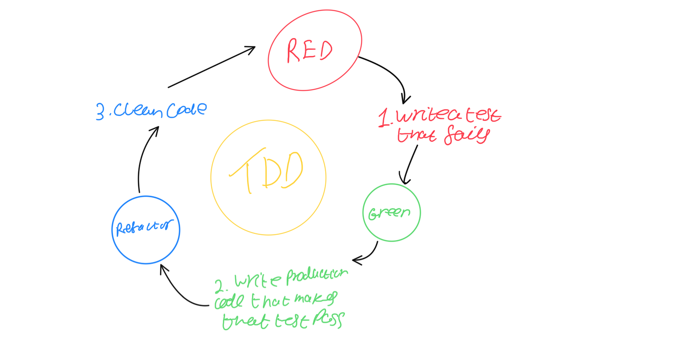

# Test Driven Development (TDD)
Writing the test **BEFORE** you write the code

Let's dive in to coding
1. Create a new repo called `python_TDD`
2. Create a new project on PyCharm with same name
3. Create a test file called `calc_test.py` (naming conventions essential)
4. Create file called `simple_calc` to write code to pass the tests
5. Let's create a file called `calc_test.pty`
    - We will use `unittest` and `pytest
    - `python -m unittest` in the command line to run the test
    - `python -m discover -v` to see the results of the test
6. `pip install pytest` is used if `pytest` is not already installed

## The tests
Let's import unittest and pytest as these are the dependencies
```python
import unittest
import pytest
```
and we'll also import the `SimpleCalc` class from our `simple_calc` file
```python
from simple_calc import SimpleCalc
```
Then we'll create a test class that we're going to use to run all our tests. We'll use `unittest.TestCase` to tell the program that this is what we want to define as our test
```python
class Calctest(unittest.TestCase):

    calc = SimpleCalc()
```
Assertions to write our test cases

We will use our basic calc example to write the tests first then the code
```python
    def test_add(self):
        # Naming conventions is essential
        self.assertEqual(self.calc.add(3, 2), 5) # if 3 + 2 = 5 is True test would pass
        # return num1 + num2
```
[`assertEqual`](https://docs.python.org/3/library/unittest.html#unittest.TestCase.assertEqual) simply tests that first and second are equal. If the values do not compare equal, the test will fail.

Then the calculator and the function we want to test is called. The structure of `(3, 2), 5` is simple. The values in the bracket are what's going to be passed into the program and the value outside the brackets is the expected result back. So we're giving the calculator `3` and `2` and expecting the answer to be `5`
```python
    def test_subtract(self):
        self.assertEqual(self.calc.subtract(3, 2), 1) # 3 - 2 = 1

    def test_multi(self):
        self.assertEqual(self.calc.multi(2, 2), 4) # 2 * 2 = 4

    def test_divide(self):
        self.assertEqual(self.calc.divide(6, 3), 2) # 6 / 3 = 2
```
Ok so let's head over to `simple_calc.py` now to see the program that's written in there:
```python
class SimpleCalc:

    def add(self, num1, num2):
        return num1 + num2

    def subtract(self, num1, num2):
        return num1 - num2

    def multi(self, num1, num2):
        return num1 * num2

    def divide(self, num1, num2):
        return num1 / num2
```
So the test above is simply calling each of the functions in `simple_calc`, inserting the values defined in `assertEqual` and seeing if the response is equal to the test parameters!